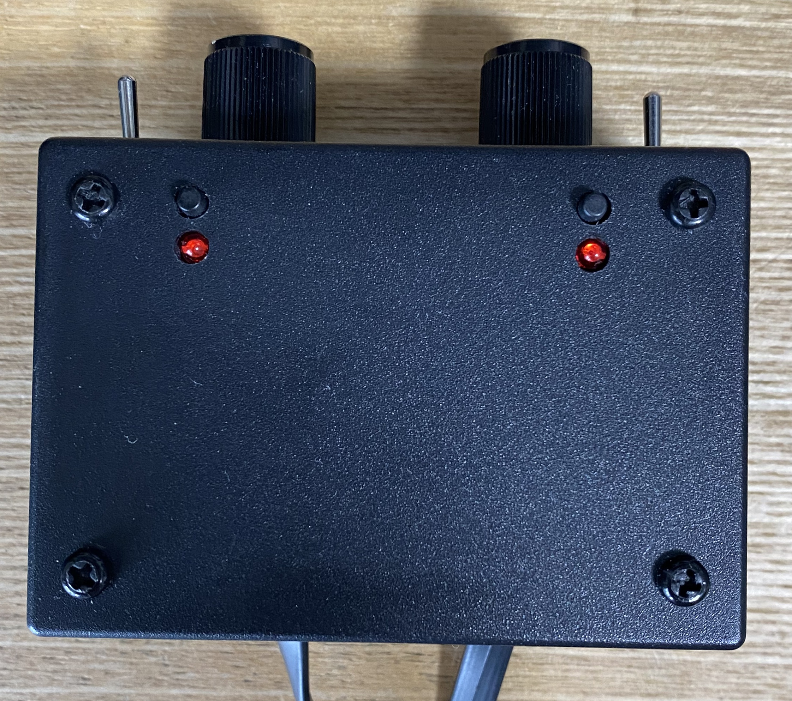

[STM32F303K8Nucleo](https://www.st.com/en/evaluation-tools/nucleo-f303k8) で [NXTモータ](https://www.lego.com/cdn/product-assets/product.bi.core.pdf/4520731.pdf) を動かすプロジェクト
===

## STM32F303K8Nucleo 改造点

以下の 0Ω抵抗 をはずす

A5-D5を切断するため
* SB16

A4-D4を切断するため
* SB18

マイコンを外部3.3V電源で駆動させるため
* SB9
* SB14

## 構成

おもな部品

|部品|個数|
|:---|:---|
|NXTモータ|2|
|TA7291P（モータドライバ）|2|
|STM32F303K8Nucleo|1|
|LED|2|
|タクトスイッチ|2|
|トグルスイッチ|2|
|ボリューム（B10K)|2|
|TA48033S（レギュレータ）|1|
|9V ACアダプタ|1|